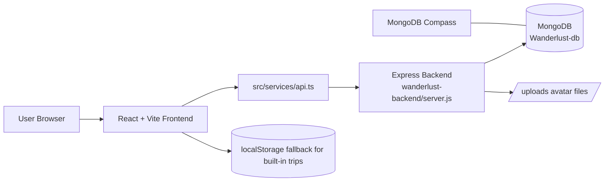

# Wanderlust Architecture

```mermaid
flowchart LR
  U[User Browser] --> FE[React + Vite Frontend]
  FE --> API[src/services/api.ts]
  API --> BE[Express Backend<br/>wanderlust-backend/server.js]
  BE --> DB[(MongoDB<br/>Wanderlust-db)]
  BE --> FS[/uploads avatar files/]
  FE --> LS[(localStorage fallback for built-in trips)]
  C[MongoDB Compass] --- DB
```
